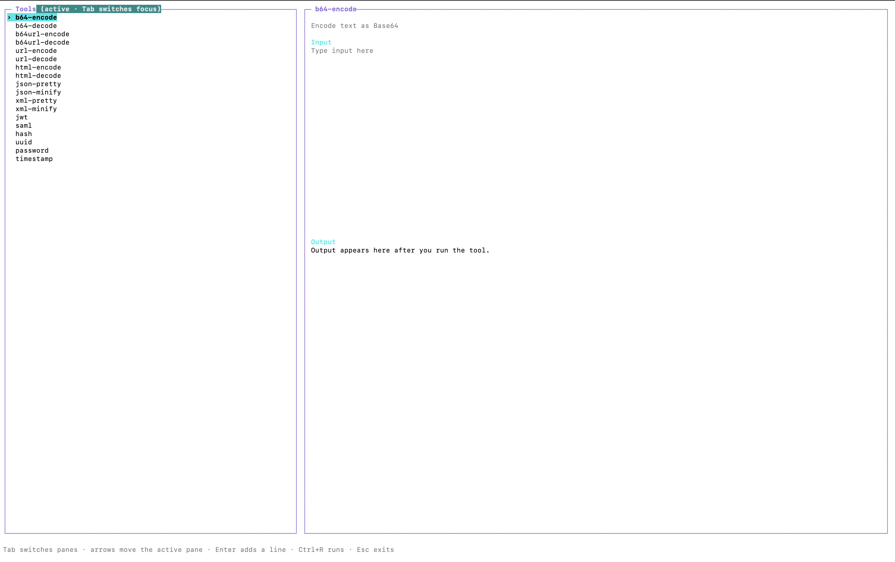

# Utils CLI



Utils CLI (`uc`) brings the browser utilities from [WSO2 CS Tools](https://wso2-cs.github.io/cs-tools/) to the terminal as a small Go binary. It supports the documented encoders, JSON/XML formatters, JWT and SAML decoding, hashes, UUIDs, passwords, and timestamps. Run `uc --help` for the full command list.

## Install

Install the latest release with one command:

```sh
curl -fsSL https://raw.githubusercontent.com/pavinduLakshan/utilscli/main/install.sh | sh
```

## Usage

Run `uc` with no arguments to open the interactive terminal UI. The tools panel is active first: use the arrow keys to choose a tool, then press Tab to move between the tool list, editor, and output. Enter adds a line to an active editor; Ctrl+R runs the selected tool. Long output can be scrolled with Page Up/Page Down, the arrow keys while the output is active, or the mouse wheel. Ctrl+Y copies the complete output to the system clipboard. UUID and password generation do not require input.

Individual commands are also supported. See the documentation for all supported commands.

Eg:

```sh
uc b64-encode "I'm feeling Lucky"
# SSdtIGZlZWxpbmcgTHVja3k=
```
